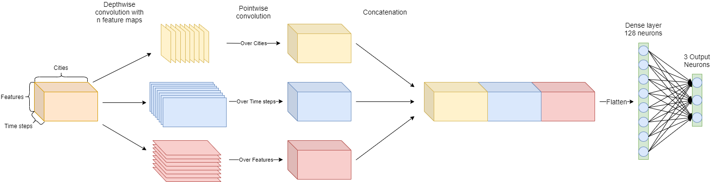

# Code for the Paper "*Wind speed prediction using multidimensional convolutional neuralnetworks*"



## Usage
1. Install the necessary packages from the `requirements.txt`.
2. Specify the training parameters in `train.py`.
3. Execute `train.py`.

## Training parameters
It is possible to train multiple models after each other by adding them to the list of `models_to_test` in the `train_wind` and `train_wind_nl` functions.

## Proposed model
Our proposed model can be found in [wind_models.py](models/wind_models.py) under the name `MultidimConvNetwork`. The Multidimensional Convolution Layer can be found in the same file under `MultidimConv`.
 
 ### Citation   
```
@article{trebing2020wind,
  title={Wind speed prediction using multidimensional convolutional neural networks},
  author={Trebing, Kevin and Mehrkanoon, Siamak},
  year={2020}
}
```   